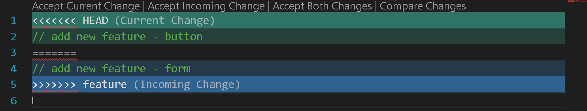

# Git and GitHub

## Git

- Popular, Free & Open Source
- **Version Control System :** Tools that help to tracks changes in code.
  - Track History
  - Help to Collaborate

### Using Git

- By Command line (Most Popular)
- IDE (Integrated Development Enviornment) / Code Editors (like VS Code)
- GUI (Graphical User Interface) (like GitKraken)

### Git Installition

1. Go to **[Git-SCM](https://git-scm.com/)** website.
2. Now go to [Downloads](https://git-scm.com/install/windows) page for windows.
3. Now click on **click here to download**.

### Git Configuring

- `git config --global user.name "Your Name"`
- `git config --global user.email "someone@gmail.com"`

> - we can see our details using a command :  
**`git config --list`**  
> - To see the hidden folder inside a folder using commands.  
**`ls -a`**

---

## GitHub

- Website where we host repositories online.

### Create account on GitHub

1. Go to **[GitHub](https://github.com/)** website.
2. Enter your **personal email id** and click **Sign up for GitHub**.
3. Create a **Strong Password** and click continue.
4. Set a **username** for your GitHub account and click continue.
5. Click **Continue for free**.

---

## Basic Git Commands

- **Clone :** Cloning (Copy / Duplicate) a repository on our local machine.

  - **`git clone <-repository link which is used to clone->`**
- **Status :** Display the state of the code.
  - **`git status`**

- **Add :** Adds new or changed files in your working directory to the git staging area.

  - **`git add <-file name->`** : Used to add single file in a folder.
  - **`git add .`** : Used to add all files in a folder.

- **Commit :**  
  1. Commit is the two step process.
  2. It is the record of change.

  - **`git commit -m "some meaningful message"`**

- **Push :** To upload local repo content to remote repo.

  - **`git push origin main`**

---

## File Status Lifecycle

    _____________       ______________        ____________          _________
    | Untracked |       | Unmodified |        | modified |          |staged |
    _____________       ______________        ____________          _________
          |                    |                    |                   |
          |                    | Edit the file =>   |                   |
          | Add the file =>    |                    | Stage the file => |
          |                    |                    |                   |
          | <= Remove the file |                    |                   |
          |                    |          <=     Commit                 |
          |                    |                    |                   |

---

## Git commonds when using the local System

- **init :** Used to create a new / initialize git repo in local folder

  - **`git init`**
  - **`git remote add origin <-remote repo link->`** : Used to set the remote path to upload our project code.
  - **`git remote -v`** : Used to verify remote.
  - **`git branch`** : Used to check branch and give the current branch name.
  - **`git branch -M main`** : Used to rename the current branch name.
  - **`git push origin main`** : Used to upload the code on GitHub.
  - **`git push -u origin main`** : Also used to upload the code with defining upstream on GitHub. After that we can use only **`git push`** command for furthur code pusing in remote repo.

---

## Workflow

**GitHub :**

- Changes in code ---> commit ---> PR (Pull Request)

**Local System :**

- changes in code ---> add (stage change) ---> commit (commit change) ---> push ---> PR (Pull Request)

---

## Git Branches

- default branch is main branch.
- **`git checkout <-branch name->`** : Used to navigate.
- **`git checkout -b <-new branch name->`** : Used to create new branch.
- **`git branch -d <-branch name->`** : Used to delete a branch. Before delete a branch, check that you not in that branch which is used to delete.

---

## Merging Code

- **`git diff <-branch name->`** : Used to compare commits, branches, files & more.
- **`git merge <-branch name->`** : Used to merge 2 branches.  
**OR**  
Create a ***PR (Pull Request)***.

- **Pull Request :**

It lets you tell others about changesyou've pushed to a branch in a repository on GitHub.

---

## Pull Command

- Used to pull remote repo in local system.
- Used to fetch and download content from a remote repo and immediately update the local repo to match that content.
- **`git pull origin main`**

---

## Merge Conflicts

- An event that takes place when Git is unable to automatically resolve differences in code between two commits.

- For resolving this conflict, remove the extra lines except the code.

---

## Fixing Mistakes

**Case 1 : Staged Changes** : Add unwanted changes.

- **`git reset <-file name->`** : To reset a last commit only for one file.
- **`git reset`** : To reset last (recent) commit from all files.

**Case 2 : Commited Changes** : For one commit.

- **`git reset HEAD~1`** : HEAD is a pointer which refer to the last (recent) commit.

**Case 3 : Commited Changes** : For many commits.

- **`git reset <-commit hash->`** : Reset the changes and also show the all changes after that.
- **`git reset --hard <-commit hash->`** : Reset the changes and delete the all changes after that.

---

## Forking

- A fork is a new repository that shares code and visibility settings with the original "upstream" repository.
- Fork is a rough copy.
